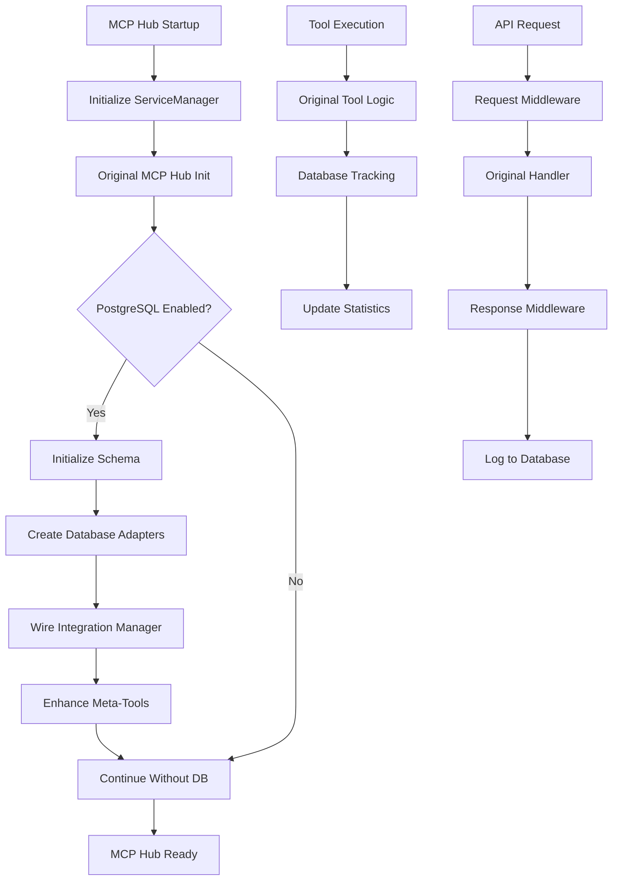
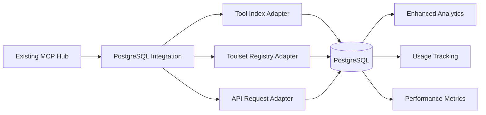

# PostgreSQL Hub Integration

This directory contains the complete PostgreSQL database integration for the MCP Hub. This integration provides comprehensive tracking, analytics, and enhanced functionality for all MCP Hub operations while maintaining full backward compatibility.

## Overview

The PostgreSQL Hub Integration consists of several key components:

### Core Components

- **`postgres-hub-integration.js`** - Main integration manager that wires together all database adapters with existing MCP Hub components
- **`postgres-hub-init.js`** - Initialization and lifecycle management for the integration
- **`postgres-service-manager.js`** - Enhanced ServiceManager that adds PostgreSQL functionality to the existing MCP Hub startup process
- **`../database/`** - Database adapters, schema management, and PostgreSQL connection handling

## Features

### 🎯 Core Integration Features

- **Seamless Integration** - Hooks into existing MCP Hub components without breaking changes
- **Tool Index Database Tracking** - All tool registrations and usage tracked in PostgreSQL
- **Toolset Registry Enhancement** - Enhanced meta-tools with database-backed analytics
- **API Request Logging** - Comprehensive tracking of all REST API requests
- **Real-time Data Synchronization** - SSE events synchronized with database changes
- **Enhanced Meta-Tools** - New database-backed tools for advanced analytics

### 📊 Database Tracking

The integration tracks:

- **Servers** - Registration, connections, health status, tool counts
- **Tools** - Registrations, usage statistics, execution times, categories
- **Tool Executions** - Individual tool calls with parameters, results, timing
- **Chain Executions** - Multi-tool chains with step-by-step tracking and analytics
- **API Requests** - Complete HTTP request/response logging with performance metrics
- **Server Connections** - Connection events, health checks, authentication states
- **System Events** - Comprehensive event logging for monitoring and debugging

### 🔧 Enhanced Tools

The integration adds several enhanced MCP tools:

- **`hub__analytics_advanced`** - Advanced analytics with database-backed metrics
- **`hub__database_status`** - Real-time database integration health and status
- **`hub__chain_tools`** - Enhanced chain execution with database tracking

## Installation & Setup

### Prerequisites

1. PostgreSQL server (version 12+ recommended)
2. Database credentials with CREATE privileges
3. Node.js dependencies (handled by MCP Hub)

### Database Setup

#### Option 1: Automatic Setup (Recommended)

The integration will automatically create the database schema on first startup:

```bash
# Set environment variables
export POSTGRES_HOST=localhost
export POSTGRES_PORT=5432
export POSTGRES_DB=mcphub
export POSTGRES_USER=mcphub
export POSTGRES_PASSWORD=your_password_here

# Start MCP Hub - schema will be created automatically
npm start
```

#### Option 2: Manual Database Setup

```sql
-- Create database and user
CREATE DATABASE mcphub;
CREATE USER mcphub WITH PASSWORD 'your_password_here';
GRANT ALL PRIVILEGES ON DATABASE mcphub TO mcphub;

-- Connect to mcphub database
\c mcphub

-- Run the schema creation script
\i src/database/comprehensive-mcp-schema.sql
```

### Configuration

Add PostgreSQL configuration to your MCP Hub config:

```json
{
  "postgresql": {
    "host": "localhost",
    "port": 5432,
    "database": "mcphub",
    "user": "mcphub",
    "password": "your_password_here",
    "ssl": false,
    "max": 20,
    "idleTimeoutMillis": 30000,
    "connectionTimeoutMillis": 5000
  },
  "enableDatabaseTracking": true,
  "enableApiLogging": true,
  "enableRealTimeSync": true,
  "enableEnhancedMetaTools": true,
  "postgresqlFallbackOnError": true
}
```

### Environment Variables

```bash
# Database connection
POSTGRES_HOST=localhost
POSTGRES_PORT=5432
POSTGRES_DB=mcphub
POSTGRES_USER=mcphub
POSTGRES_PASSWORD=your_password_here
POSTGRES_SSL=false
POSTGRES_MAX_CONNECTIONS=20

# Integration options
ENABLE_DATABASE_TRACKING=true
ENABLE_API_LOGGING=true
ENABLE_REAL_TIME_SYNC=true
ENABLE_ENHANCED_META_TOOLS=true
POSTGRESQL_FALLBACK_ON_ERROR=true
```

## Usage

### Starting MCP Hub with PostgreSQL Integration

The integration is automatically included when you start MCP Hub with PostgreSQL configuration:

```bash
npm start
```

You'll see log messages indicating the integration status:

```
[INFO] Starting PostgreSQL Hub Integration
[INFO] Initializing PostgreSQL database schema
[INFO] Database schema initialized successfully
[INFO] PostgreSQL Hub Integration initialized successfully
[INFO] Enhanced meta-tools with database backend
```

### Accessing Enhanced Features

#### Via MCP Tools

Use the enhanced meta-tools through any MCP client:

```bash
# Get advanced analytics
mcp call hub__analytics_advanced '{"timeRange": "24 hours"}'

# Check database status
mcp call hub__database_status '{"verbose": true}'

# Enhanced chain execution (automatically tracked)
mcp call hub__chain_tools '{"chain": [...]}'
```

#### Via REST API

New REST endpoints are available:

```bash
# PostgreSQL health check
curl http://localhost:3001/api/postgresql/health

# Integration metrics
curl http://localhost:3001/api/postgresql/metrics

# Advanced analytics
curl http://localhost:3001/api/postgresql/analytics?timeRange=7%20days
```

### Enhanced Tool Listings

All existing MCP tools now provide enhanced information when PostgreSQL is enabled:

```bash
# Enhanced server listing with database statistics
mcp call List_All_Servers '{}'

# Enhanced tool listing with usage metrics
mcp call List_Server_Tools '{"server_name": "example-server"}'

# Enhanced all tools list with analytics
mcp call List_All_Tools '{"format": "detailed"}'
```

## Architecture

### Integration Flow



### Database Schema Overview

The integration uses a comprehensive PostgreSQL schema:

- **`mcp_servers`** - Server registrations and metadata
- **`mcp_tools`** - Tool definitions and capabilities  
- **`mcp_tool_executions`** - Individual tool execution records
- **`mcp_chain_executions`** - Multi-tool chain tracking
- **`mcp_api_requests`** - HTTP request/response logging
- **`mcp_server_connections`** - Connection event tracking
- **`mcp_health_metrics`** - System health and performance data
- **`mcp_system_events`** - Comprehensive event logging

### Component Integration



## Monitoring & Analytics

### Real-time Monitoring

The integration provides comprehensive monitoring capabilities:

#### Server Health Dashboard

```bash
# Check overall health
curl http://localhost:3001/api/postgresql/health
```

Response:
```json
{
  "status": "healthy",
  "initialized": true,
  "adapters": {
    "available": 3,
    "connected": 3,
    "total": 3
  },
  "databaseConnectivity": "ok",
  "healthy": true
}
```

#### Performance Metrics

```bash
# Get detailed metrics
curl http://localhost:3001/api/postgresql/metrics
```

Response:
```json
{
  "available": true,
  "metrics": {
    "serversTracked": 15,
    "toolsTracked": 162,
    "executionsTracked": 1423,
    "apiRequestsTracked": 892,
    "chainsExecuted": 45
  }
}
```

### Analytics Queries

#### Direct SQL Access

You can query the database directly for custom analytics:

```sql
-- Top 10 most used tools
SELECT 
    t.name,
    t.server_name,
    COUNT(te.id) as execution_count,
    AVG(te.duration_ms) as avg_duration_ms
FROM mcp_tools t
LEFT JOIN mcp_tool_executions te ON t.id = te.tool_id
WHERE te.created_at > NOW() - INTERVAL '7 days'
GROUP BY t.id, t.name, t.server_name
ORDER BY execution_count DESC
LIMIT 10;

-- Chain execution success rates
SELECT 
    DATE(created_at) as date,
    COUNT(*) as total_chains,
    COUNT(CASE WHEN status = 'completed' THEN 1 END) as successful,
    ROUND(
        COUNT(CASE WHEN status = 'completed' THEN 1 END) * 100.0 / COUNT(*), 
        2
    ) as success_rate
FROM mcp_chain_executions
WHERE created_at > NOW() - INTERVAL '30 days'
GROUP BY DATE(created_at)
ORDER BY date;

-- API request performance by endpoint
SELECT 
    method,
    path,
    COUNT(*) as request_count,
    AVG(duration_ms) as avg_duration_ms,
    PERCENTILE_CONT(0.95) WITHIN GROUP (ORDER BY duration_ms) as p95_duration_ms
FROM mcp_api_requests
WHERE created_at > NOW() - INTERVAL '24 hours'
GROUP BY method, path
ORDER BY request_count DESC;
```

## Troubleshooting

### Common Issues

#### 1. Database Connection Failed

**Symptom**: Integration fails during startup with connection errors

**Solutions**:
- Verify PostgreSQL server is running
- Check connection credentials
- Ensure database exists and user has proper permissions
- Check firewall settings if connecting to remote database

```bash
# Test database connection
psql -h localhost -U mcphub -d mcphub -c "SELECT version();"
```

#### 2. Schema Initialization Failed

**Symptom**: Tables not created or migration errors

**Solutions**:
- Ensure user has CREATE privileges
- Check for existing conflicting tables
- Review database logs for specific errors

```sql
-- Grant required permissions
GRANT CREATE ON DATABASE mcphub TO mcphub;
GRANT USAGE ON SCHEMA public TO mcphub;
GRANT CREATE ON SCHEMA public TO mcphub;
```

#### 3. Fallback Mode Active

**Symptom**: Integration running in fallback mode without database features

**Solutions**:
- Check MCP Hub logs for initialization errors
- Verify PostgreSQL configuration
- Test database connectivity
- Check if `postgresqlFallbackOnError` is set to `true`

#### 4. Performance Issues

**Symptom**: Slow response times or high database load

**Solutions**:
- Check database indexes are created
- Monitor connection pool usage
- Consider increasing `max` connections if needed
- Review long-running queries

```sql
-- Check active connections
SELECT count(*) FROM pg_stat_activity WHERE datname = 'mcphub';

-- Check slow queries
SELECT query, mean_time, calls 
FROM pg_stat_statements 
WHERE query LIKE '%mcp_%' 
ORDER BY mean_time DESC;
```

### Debugging

Enable debug logging for detailed information:

```bash
export LOG_LEVEL=debug
npm start
```

Or check specific integration logs:

```bash
# Filter PostgreSQL integration logs
tail -f logs/mcp-hub.log | grep -i postgres

# Check database query logs (if enabled in PostgreSQL)
tail -f /var/log/postgresql/postgresql-*.log
```

### Recovery

#### Reset Integration

If the integration gets into a bad state:

```bash
# Stop MCP Hub
npm stop

# Clear database (WARNING: This removes all tracked data)
psql -h localhost -U mcphub -d mcphub -c "DROP SCHEMA mcp CASCADE; CREATE SCHEMA mcp;"

# Restart MCP Hub (schema will be recreated)
npm start
```

#### Partial Reset

To reset only specific components:

```sql
-- Reset tool execution tracking
TRUNCATE TABLE mcp_tool_executions, mcp_chain_executions;

-- Reset API request logs
TRUNCATE TABLE mcp_api_requests;

-- Reset health metrics
TRUNCATE TABLE mcp_health_metrics;
```

## Development

### Adding New Database Features

1. **Extend Schema** - Add new tables/columns in `comprehensive-mcp-schema.sql`
2. **Update Adapters** - Add new methods to appropriate adapter classes
3. **Enhance Integration** - Update integration manager to use new features
4. **Add Tests** - Include unit and integration tests
5. **Update Documentation** - Add to this README and API docs

### Testing

```bash
# Run integration tests
npm test -- --grep "PostgreSQL"

# Run specific adapter tests
npm test -- --grep "DatabaseAdapter"

# Run end-to-end tests
npm run test:e2e -- --grep "postgres"
```

### Contributing

1. Follow existing code patterns and style
2. Add comprehensive error handling and logging
3. Include unit tests for new functionality
4. Update documentation for user-facing changes
5. Test with both PostgreSQL available and unavailable scenarios

## Performance Considerations

### Recommended Settings

For production deployments:

```json
{
  "postgresql": {
    "max": 20,
    "idleTimeoutMillis": 30000,
    "connectionTimeoutMillis": 5000
  },
  "enableApiLogging": true,
  "enableDatabaseTracking": true,
  "postgresqlFallbackOnError": true
}
```

### Monitoring

- Monitor connection pool usage
- Watch for long-running queries
- Set up alerts for failed database operations
- Monitor disk space for log tables

### Optimization

- Regularly clean up old log entries
- Consider partitioning large tables by date
- Monitor and maintain database indexes
- Use connection pooling appropriately

## Security Considerations

- Store database credentials securely (environment variables, secrets management)
- Use SSL connections for remote databases
- Regularly update PostgreSQL to latest stable version
- Monitor database access logs
- Implement proper backup and recovery procedures
- Consider encrypting sensitive data at rest

---

This PostgreSQL Hub Integration provides a robust foundation for advanced MCP Hub analytics and tracking while maintaining the simplicity and reliability of the existing MCP Hub architecture.
